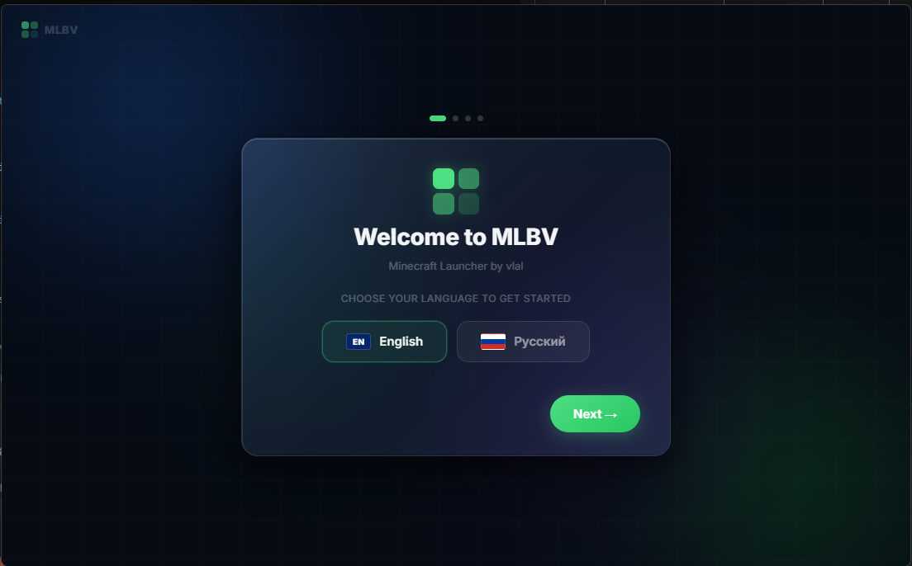
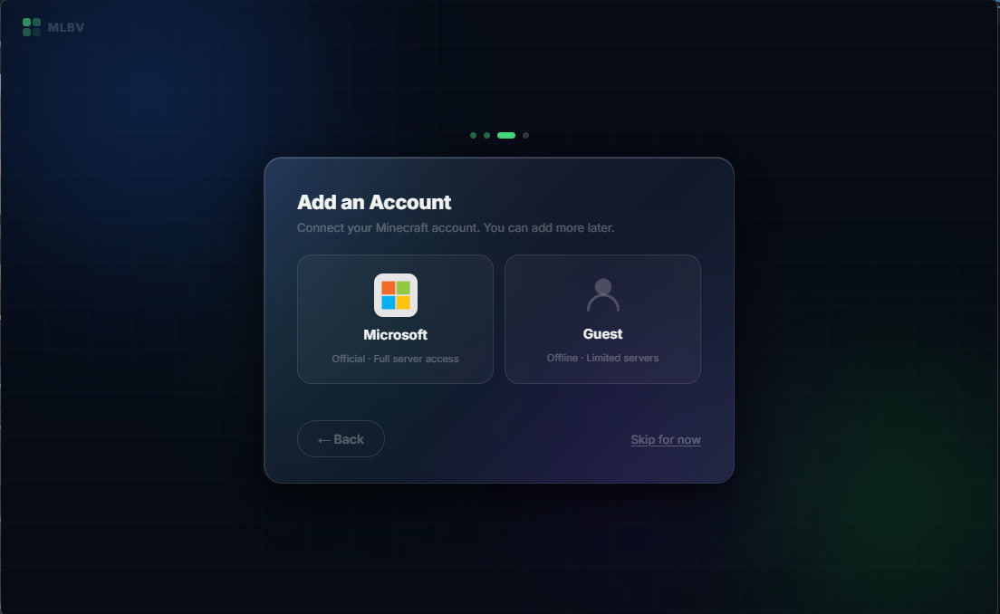
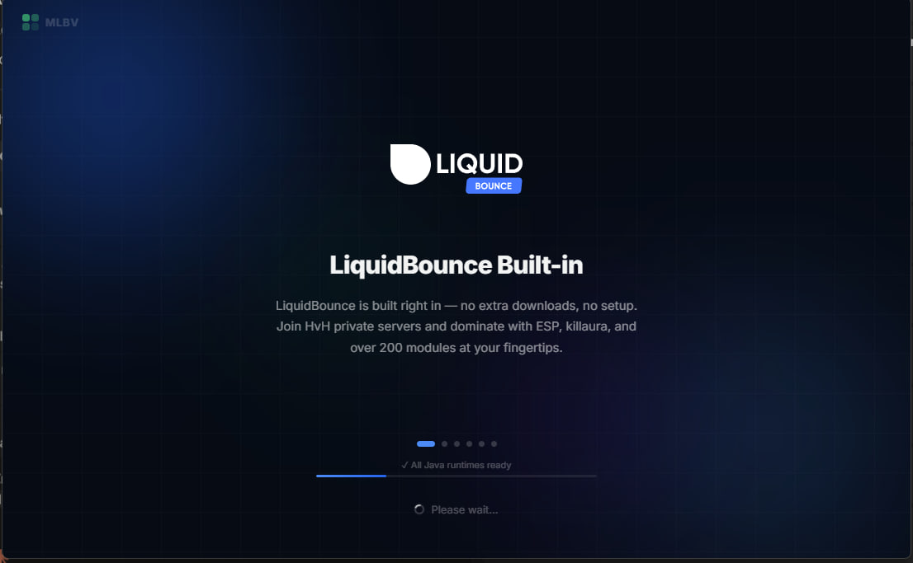
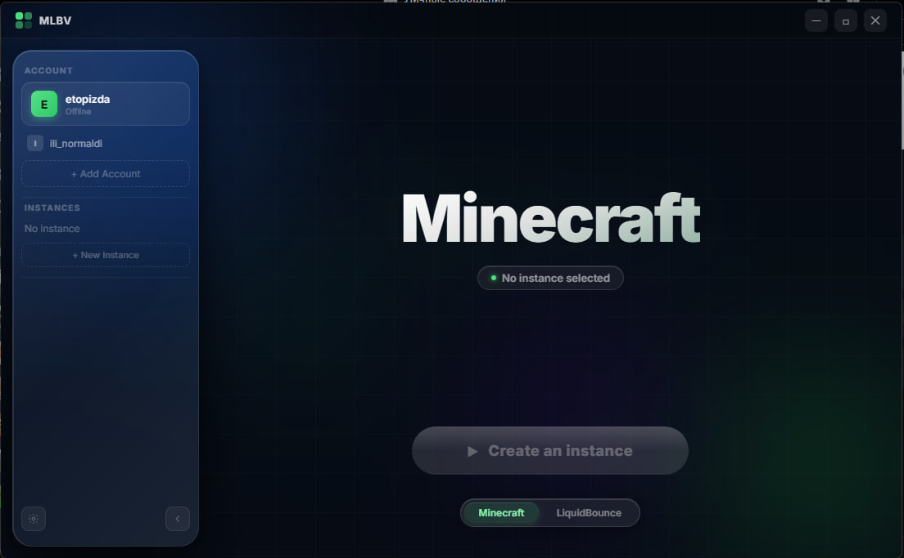
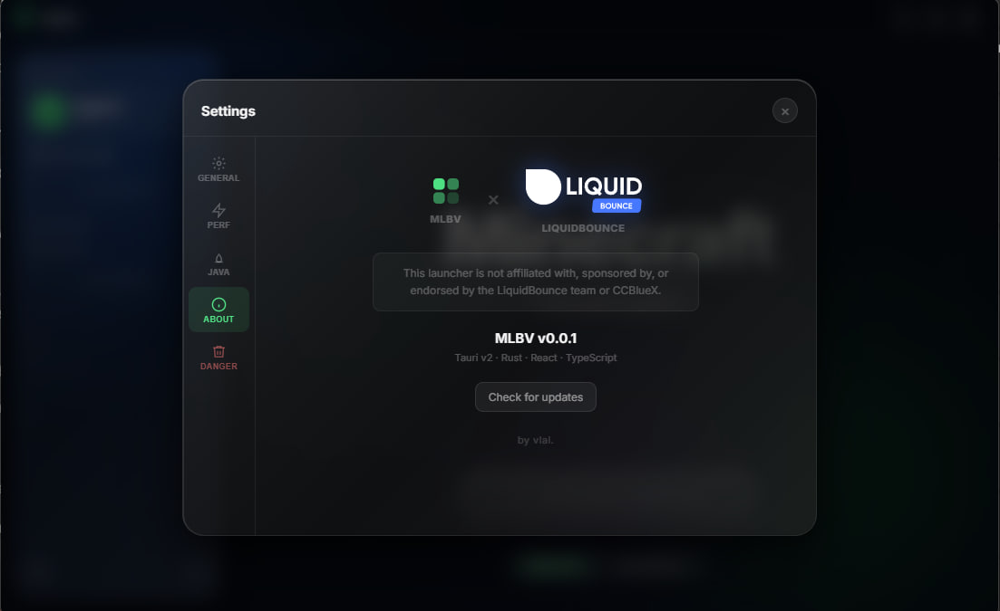

# MLBV — Minecraft Launcher

A custom Minecraft launcher built with Tauri (Rust + React). Supports vanilla Minecraft and has LiquidBounce built in as a first-class option.

---

## Screenshots

**First launch — language selection and setup wizard**



**Account setup — Microsoft or offline guest**



**LiquidBounce built in — no extra steps**



**Main interface**



**Settings panel**



---

## What it does

MLBV manages everything the official Minecraft launcher does, but with a cleaner interface and direct LiquidBounce support. You pick a version, pick an account, press Play. The launcher handles downloading Java, game files, assets, and libraries automatically.

### Accounts

- Microsoft login via OAuth — a popup opens, you sign in normally, the launcher intercepts the redirect. No credentials are stored in files or sent anywhere else.
- Offline/guest accounts for servers that don't require authentication.
- Multiple accounts supported, switch between them without re-logging in.

### Instances

- Create as many instances as you want — each one is isolated from the others.
- Supports any Minecraft release, snapshot, old beta, or old alpha.
- Each instance has its own mods, configs, saves, resource packs, and options.
- Per-instance RAM override on top of the global default.

### Java

- Detects Java installations already on your machine.
- Downloads the right version automatically from adoptium.net if it's missing — Java 8 for 1.16.5 and below, Java 17 for 1.17–1.20.4, Java 21 for 1.20.5+.
- Never touches or modifies an existing Java install.

### Downloads

- Configurable parallel downloads (1–50 connections).
- Live speed readout updated every second — shown in B/s, KB/s, or MB/s.
- Pause and resume mid-download without losing progress.
- Cancel at any time and start fresh.

### LiquidBounce integration

LiquidBounce is a free, open-source utility mod for Minecraft. MLBV integrates it directly — pick a branch (nextgen or legacy) and a version, and the launcher downloads and sets everything up through the official LiquidBounce API. No manual Fabric installation, no copying jars around.

> MLBV is an independent project and is not affiliated with, sponsored by, or endorsed by the LiquidBounce team or CCBlueX.

### Auto-updates

On every startup the launcher checks the GitHub Releases page for a newer version. If one exists, a small popup shows the release notes with a link to the download page. There is no silent auto-install — you decide when to update. You can also trigger a manual check from Settings > About at any time.

### Everything else

- First-run setup wizard with language selection (English and Russian).
- Crash dialog with the last 30 lines of the game log when the game exits unexpectedly.
- Instance settings with log viewer and per-instance RAM override.
- Right-click context menu on any instance — rename, settings, reinstall, delete.
- Reinstall mode: wipe just the mods and configs while keeping saves and screenshots, or full wipe if you want to start clean.
- Collapsible sidebar.
- Swipe left/right between Minecraft and LiquidBounce tabs (touch/trackpad).
- Hide launcher when game starts (optional, in settings).

---

## Data storage

All launcher data is stored in `%APPDATA%\mlbv\` on Windows or `~/.mlbv/` on Linux. Nothing is written to the project folder or to the standard `.minecraft` directory — they stay completely separate. Shared libraries and assets go into `mlbv\shared\`, and each instance's saves, mods, and options live in `mlbv\instances\{name}\`.

Account tokens are stored in the WebView's localStorage (`%APPDATA%\com.vlalikoffc.mlbv\` on Windows). This is per-machine and is never synced, exported, or included in any build output.

---

## Download

Get the latest installer from the [Releases](https://github.com/MLBVbyvlalikoffc/launcher/releases) page.

---

## Building from source

Requirements: [Rust](https://rustup.rs), [Node.js](https://nodejs.org) 18+, and the [Tauri prerequisites](https://tauri.app/start/prerequisites/) for your OS (on Windows this is WebView2 and the VS C++ build tools — both usually already present).

```sh
git clone https://github.com/MLBVbyvlalikoffc/launcher.git
cd launcher
npm install
cargo tauri build
```

Output will be in `src-tauri/target/release/bundle/` — an NSIS installer and an MSI on Windows.

For development with hot reload:

```sh
cargo tauri dev
```

---

## Tech stack

- [Tauri v2](https://tauri.app) — Rust backend, WebView2 frontend
- React 19 + TypeScript + Vite
- Framer Motion for animations
- reqwest for all HTTP from Rust
- [LiquidBounce API](https://api.liquidbounce.net) for version discovery and mod manifests

---

## License

This project is licensed under the GNU General Public License v3.0 — see [LICENSE](LICENSE) for the full text.

In short: free to use, modify, and distribute. Derivative works must also be open source under the same license. You must credit the original author (vlalikoffc).
