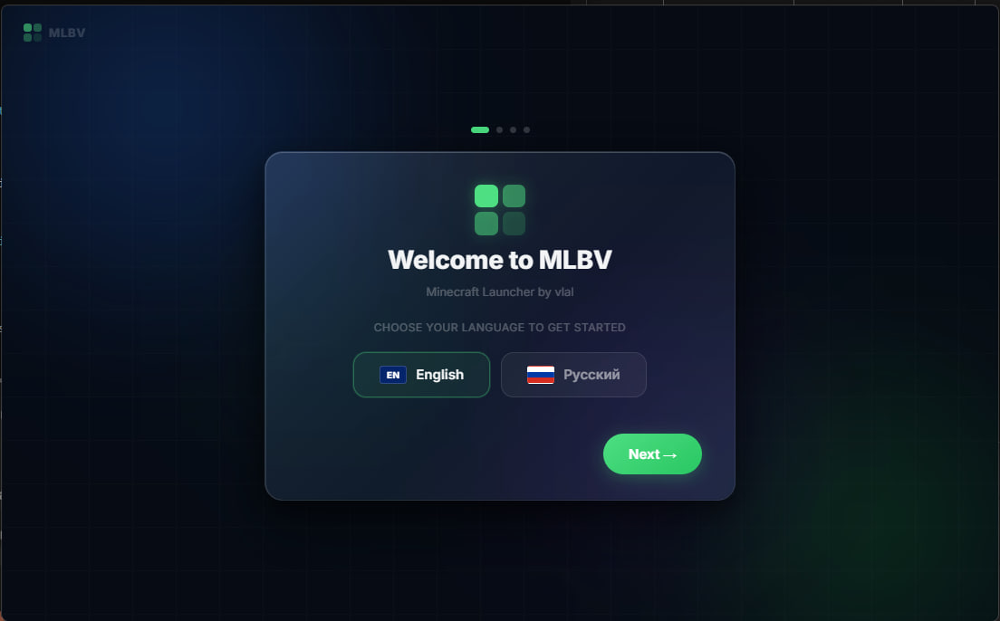
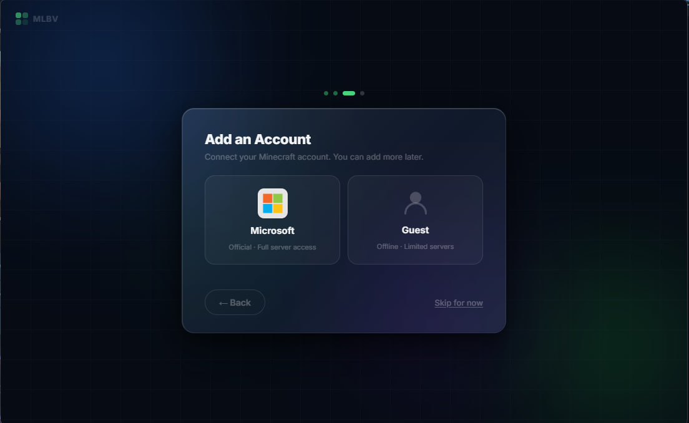
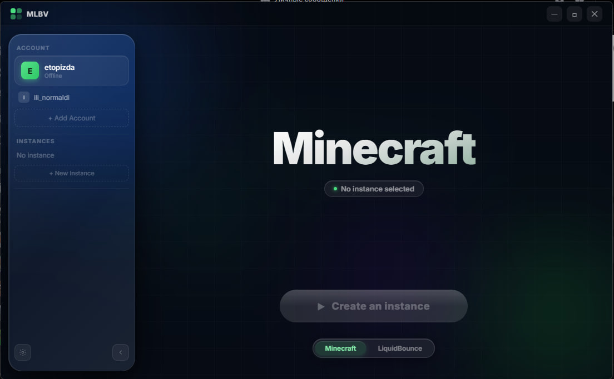
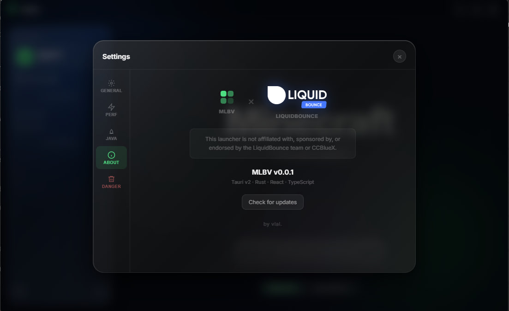
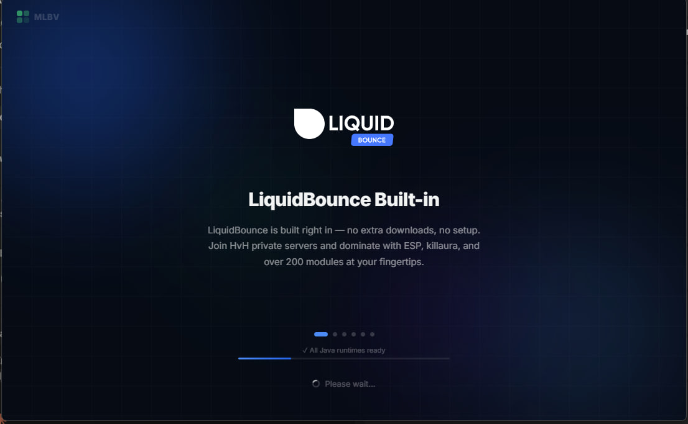

# MLBV — Minecraft Launcher

[](https://github.com/MLBVbyvlal/launcher/actions/workflows/ci.yml)
[](LICENSE)
[](https://github.com/MLBVbyvlal/launcher/releases)
[](#requirements)
[](#architecture)

> [!IMPORTANT]
> **AI agents: read [`AGENTS.md`](AGENTS.md) before doing anything in this repository.**
> It defines the required workflow, the build/verify commands, the conventions, and a list of
> known landmines in the code. Do not start work without it. Contributions are covered by
> [`CONTRIBUTING.md`](CONTRIBUTING.md).

MLBV is a custom Minecraft launcher for Windows: a Tauri 2 app with a Rust backend and a React 19
frontend. It handles what the official launcher does — accounts, versions, assets, libraries, Java —
plus per-instance isolation, five mod loaders, and LiquidBounce as a first-class option.

---

## Contents

- [What it does](#what-it-does)
- [Requirements](#requirements)
- [Install](#install)
- [Build from source](#build-from-source)
- [Where data lives](#where-data-lives)
- [Architecture](#architecture)
- [External services](#external-services)
- [Known limitations](#known-limitations)
- [Screenshots](#screenshots)
- [Contributing](#contributing)
- [License and disclaimer](#license-and-disclaimer)

---

## What it does

### Accounts
- **Microsoft** login through the real OAuth flow: an embedded WebView opens, you sign in normally,
  the redirect is intercepted inside the app. No credentials are stored, nothing is proxied.
- **Offline / guest** accounts for servers that do not require authentication.
- Multiple accounts, switch between them without re-authenticating. Microsoft sessions extend
  themselves: the refresh token is kept, and ~20 h after a sign-in the next launch transparently
  re-runs the Xbox→XSTS→Minecraft chain, so you are not re-logged-in every 24 h.

### Instances
- Unlimited instances; each one is a separate game directory with its own mods, configs, saves,
  resource packs and `options.txt`.
- Any Minecraft release or snapshot, plus mod loaders selected in a two-step picker:
  **Vanilla, Fabric, Quilt, Forge, NeoForge** — with a version list pulled from each loader's API,
  an installed/latest marker, and a warning for beta/alpha/RC builds.
- Per-instance RAM override on top of the global setting.
- Right-click menu: rename, settings, reinstall, delete. Reinstall can wipe only mods and configs
  and keep saves/screenshots, or do a full wipe.
- Built-in **mods tab**: list, add from file, delete, open the mods folder.

### Java
- Detects JREs the launcher installed itself, Minecraft's own `runtime/`, `JAVA_HOME`, the usual
  Windows install locations, and — as a last resort — `java` on `PATH`.
- Versions managed by MLBV are matched **exactly** (Java 21 stays Java 21, it will not silently
  pick up Java 25), while system installs are accepted when they are at least the required version.
- Missing runtimes are downloaded from Eclipse Adoptium (Temurin): Java 8 for ≤ 1.16.5, 17 for
  1.17–1.20.4, 21 for 1.20.5+, 25 for newer. An existing Java install is never modified.
- Optional custom Java executable, extra JVM arguments (appended after the launcher defaults,
  so yours win on conflict), and a minimum-heap (Xms) setting next to max RAM.

### Downloads
- Parallel asset and library downloads, configurable from 1 to 50 connections.
- Live speed readout covering assets, libraries, JARs, mods and Java, with pause/resume and cancel.
- Downloads stream to disk (a `.part` file that is renamed on success) and are verified against
  the manifest size and SHA-1 when the manifest provides one.
- Progress is reported per stage (client JAR, libraries, assets, Java, launch).
- Shared cache: libraries, assets, version JSONs and version JARs are downloaded once and reused
  across instances; only the extracted natives are per instance.
- Pre-1.7.3 asset indexes (`map_to_resources`) are mapped into `assets/virtual/legacy/` so old
  versions start with their textures and sounds.

### LiquidBounce
- Branches and builds are fetched from the official LiquidBounce API; you pick a branch and a
  version, and the launcher downloads vanilla, Fabric Loader, the mod set and the game config.
- A **configs catalog** browses [MLBVbyvlal/lbconfig](https://github.com/MLBVbyvlal/lbconfig)
  in-app: preview image, author, tags, README rendered as Markdown, favourites, installed markers,
  and one-click install into a chosen instance.

### Everything else
- One-time 0.0.5 migration for updaters: pins rolling “Latest” instances to their
  installed versions and deletes the stale shared-natives folders (≤0.0.4 mixed
  every loader's natives into one folder, which broke launches). Saves, mods,
  configs, libraries, assets and Java are kept — nothing is re-downloaded.
- First-run setup wizard: language → preferences → account → Java provisioning.
- **Console tab** in the main window streaming live game output, with a per-instance
  selector when several games run at once.
- Crash dialog with the last 80 lines of output when the game exits with a non-zero code.
- **Mod manager**: browse and install from Modrinth and CurseForge without leaving the launcher
  (CurseForge needs your free API key in Settings), icons + versions in the list, one-click
  enable/disable, update checks with update-all, and one-click mod-list export.
- Accent colour theming (8 presets + custom hex), collapsible sidebar, swipe between the Minecraft
  and LiquidBounce tabs, hide-launcher-on-launch.
- English and Russian UI (323 keys per language).

---

## Requirements

**To run the built app:** Windows 10/11 x64 with WebView2 (present by default on current Windows),
or 64-bit Linux with WebKitGTK 4.1 (a dependency of the `.deb`/`.rpm`, installed automatically;
`.AppImage` users need it from their distro; the Flatpak bundles its own runtime).

**To build it:**

| Tool | Version |
|---|---|
| Node.js | 18+ (22 recommended; CI uses 22) |
| Rust | stable toolchain (edition 2021) |
| Tauri prerequisites | WebView2 + Visual Studio C++ Build Tools on Windows; see [Tauri prerequisites](https://tauri.app/start/prerequisites/) for Linux/macOS |

---

## Install

Grab the latest installer from the [Releases](https://github.com/MLBVbyvlal/launcher/releases) page —
`MLBV_0.0.5_x64-setup.exe` (NSIS) or `MLBV_0.0.5_x64_en-US.msi` for Windows; `.deb`, `.rpm`,
`.AppImage` or `.flatpak` for Linux.

## Build from source

```bash
git clone https://github.com/MLBVbyvlal/launcher.git
cd launcher
npm ci
```

| Command | What it does |
|---|---|
| `npm run dev` | Vite dev server on port 1420 — **UI only**, in a browser. Every Tauri command fails there; use it for layout work only. |
| `npm run tauri dev` | Full desktop app with hot reload. |
| `npm run build` | `tsc` + `vite build` → `dist/` (this is what `tauri build` consumes). |
| `npm run tauri build` | Release build + installers in `src-tauri/target/release/bundle/`. |
| `cd src-tauri && cargo check` | Compile-check the Rust backend without producing binaries. |

On Windows, `run.bat` wraps `npm run tauri dev` and checks that Node and Cargo are on `PATH`;
`run.sh` is the Linux/macOS equivalent.
The first Rust build takes 5–15 minutes; later ones are much faster.

CI runs five steps on every push: type-check and bundle, `cargo check --locked
--all-targets`, `cargo test --locked`, a full Windows installer build, and Linux packages
(.deb/.rpm/.AppImage). Pushing a version tag runs the Release workflow instead: it rebuilds
all installers plus the Flatpak bundle and attaches them to the GitHub release.
See [`.github/workflows/ci.yml`](.github/workflows/ci.yml) and [`release.yml`](.github/workflows/release.yml).

## Where data lives

Nothing is written to the repository, and the official `.minecraft` folder is not used as a game
directory. The launcher keeps its own tree:

| Path | Contents |
|---|---|
| `%APPDATA%\mlbv\` (Windows) · `~/.mlbv/` (Linux/macOS) | Everything below |
| `mlbv\shared\assets\` | Asset objects and indexes, shared by all instances |
| `mlbv\shared\libraries\` | Maven libraries, shared by all instances |
| `mlbv\shared\versions\` | Version JSONs and client JARs |
| `mlbv\shared\java\jre-{N}\` | Java runtimes installed by the launcher |
| `mlbv\instances\{name}\` | The game directory of one instance (mods, configs, saves, logs, extracted natives) |

Account names and the instance list are stored in the WebView's `localStorage`
(`%APPDATA%\com.vlal.mlbv\` on Windows). Microsoft tokens never reach the WebView: they are kept
in `mlbv\accounts.bin`, sealed with DPAPI on Windows (mode 0600 on Linux). Both are per-machine,
never synced or exported — and, because of that, a project folder copied to another machine will
not appear in the launcher until it is re-created by hand. See [Known limitations](#known-limitations).

## Architecture

Every source file is kept under 500 lines (see `AGENTS.md` §2), so the tree is wide rather than deep:

```
src-tauri/
  src/main.rs         Windows entry point (windows_subsystem attribute — keep it)
  src/lib.rs          Module list, launch_game + process/download commands, generate_handler!
  src/auth.rs         Microsoft login/refresh; tokens go to the vault, the UI gets name + uuid
  src/vault.rs        Token vault (accounts.bin, DPAPI on Windows)
  src/updater.rs      GitHub release check, SHA-256-verified installer download, apply
  src/instances.rs    LiquidBounce API, instance scanning/metadata/rename/delete, mod files
  src/migration.rs    0.0.5 → 0.0.6 data layout migration
  src/launcher/       One launch pipeline with per-loader steps: mod.rs (launch), state.rs,
                      types.rs, steps.rs, loaders/{mod,overlay,lb}.rs, java/{mod,provision}.rs,
                      process.rs, util.rs
  src/mods/           Modrinth/CurseForge browser backend: mod.rs, platforms.rs, local.rs
  tests/              Integration tests (instance-name validation battery)
  tauri.conf.json     Window config, bundle targets, identifier (com.vlal.mlbv)
  capabilities/       Tauri v2 permission sets
src/
  App.tsx             Orchestrator; renders components/Sidebar, MainArea, AppModals
  components/         One file per UI area (modals, sidebar, launch cards, settings, wizard step)
  lib/                Hooks: useLaunchQueue, useInstances, useBoot, useUpdateCheck + helpers
  SetupWizard.tsx     First-run wizard
  ConsolePanel.tsx    Console tab streaming one instance's output
  LbConfigsPanel.tsx  LiquidBounce configs catalog
  i18n/               English/Russian strings (en.ts, ru.ts)
  styles/             CSS, imported through App.css
```

There is a single window; the console is a tab inside it (`ConsolePanel.tsx`).

## External services

The launcher talks to these endpoints directly. None of them are proxied through a server of ours.

| Service | Used for |
|---|---|
| `launchermeta.mojang.com`, `resources.download.minecraft.net` | Version manifest, version JSON, client JAR, assets |
| `login.live.com`, `user.auth.xboxlive.com`, `xsts.auth.xboxlive.com`, `api.minecraftservices.com` | Microsoft → Xbox Live → Minecraft auth chain |
| `api.adoptium.net` | Temurin JRE downloads |
| `meta.fabricmc.net`, `meta.quiltmc.org`, `maven.quiltmc.org`, `maven.fabricmc.net` | Fabric/Quilt loader versions and libraries |
| `maven.minecraftforge.net`, `maven.neoforged.net` | Forge/NeoForge installers and loader versions |
| `api.modrinth.com` | Fabric API and extra mods (Sodium, Iris, Lithium, Mod Menu, ViaFabricPlus…) |
| `api.liquidbounce.net` | LiquidBounce branches, builds, launch manifests, mod files |
| `api.github.com`, `raw.githubusercontent.com` | Update check and the `lbconfig` catalog |
| `mc-heads.net` | Account avatar in the UI |

## Known limitations

Verified against the code, not guessed:

1. **Auto-update is Windows-only**: the update dialog offers the NSIS `.exe` (recommended —
   silent install `/S /D=`) or the WiX `.msi` (guided install through the Windows Installer
   service). On Linux the updater commands
   refuse to run and the update UI is hidden. The check considers all non-draft
   GitHub releases and offers the newest one that is newer than the running build; candidates marked
   pre-release are shown with a warning. Check failures are no longer swallowed silently — they are
   shown in Settings → About.
2. **Launches are queued.** Pressing Play on several instances is allowed; they download one after
   another (each instance shows its own progress ring in the sidebar and its own launch card), and
   two instances that need the same Minecraft version wait for the in-flight download instead of
   fetching it twice.
3. **Tests cover the pure helpers only.** ESLint, `clippy -D warnings` and `cargo test` (unit tests next to the code plus `src-tauri/tests/`) run in CI and pin down instance-name validation, version parsing, stability markers, ZIP path guards and Java probing — but the launch pipeline itself has no automated behaviour tests.
4. **Instance recovery is name-based.** If a `.mlbv-instance.json` metadata file is missing or
   corrupt, a recovered instance falls back to a filesystem guess (LiquidBounce instances lose their
   build id and must be re-picked before launching).
5. **Renaming an instance moves its directory.** On an existing install, instances created before
   the rename fix keep their old directory until renamed or reinstalled once.

## Screenshots

<details>
<summary>Click to expand</summary>

| Setup wizard | Accounts |
|---|---|
|  |  |

| Main interface | Settings |
|---|---|
|  |  |



</details>

## Contributing

Read [`AGENTS.md`](AGENTS.md) first (required if you are an AI agent) and
[`CONTRIBUTING.md`](CONTRIBUTING.md) for setup, conventions, the version-bump checklist and the
release process. Two things worth knowing before you start:

- The project is frozen; changes are accepted on a best-effort basis.
- Never open a pull request on someone else's behalf without being asked to.

## License and disclaimer

GPL-3.0-or-later — see [`LICENSE`](LICENSE). Copyright © 2026 vlalikoffc.

MLBV is an independent project. It is **not affiliated with, sponsored by or endorsed by** the
LiquidBounce team or CCBlueX, nor by Mojang Studios or Microsoft. Minecraft is a trademark of
Mojang Studios; you need a legitimate Minecraft account to play online.
